# Enterprise Business RAG Platform

> Production-grade Retrieval-Augmented Generation (RAG) platform for business intelligence, annual report analysis, executive summaries, financial insights, and multi-company comparisons using LLMs, Vector Search, and Semantic Retrieval.

---

## Overview

Enterprise Business RAG Platform is an AI-powered business intelligence assistant designed to analyze annual reports from leading global companies and answer strategic business questions using Retrieval-Augmented Generation (RAG).

The platform combines semantic search, vector databases, embeddings, and Large Language Models to generate:

- Executive Summaries
- Revenue Analysis
- Business Segment Analysis
- AI Strategy Insights
- Cloud Platform Comparisons
- Risk Assessments
- Multi-Company Comparisons

Unlike traditional PDF chatbots, this platform focuses on enterprise knowledge discovery and business intelligence workflows.

---

## Architecture

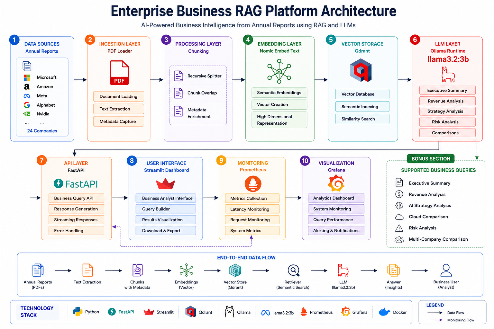

---

## Performance Metrics

| Metric | Value |
|----------|----------|
| Companies Indexed | 24 |
| Annual Reports | 24 |
| Knowledge Chunks | 27,253+ |
| Vector Database | Qdrant |
| Embedding Model | Nomic Embed Text |
| LLM | Llama 3.2 (3B) |
| Backend | FastAPI |
| Frontend | Streamlit |
| Monitoring | Prometheus + Grafana |
| Deployment | Docker |

---

## Key Features

### Executive Summary Generation

Generate concise executive summaries from company annual reports.

Example:

```text
Give executive summary of Microsoft
```

### Revenue Analysis

Analyze company revenue growth, financial highlights, and business performance.

Example:

```text
Give revenue analysis of Qualcomm
```

### AI Strategy Analysis

Compare AI investments and strategic positioning across companies.

Example:

```text
Compare AI strategy of Microsoft, Alphabet, Meta and Nvidia
```

### Cloud Business Analysis

Compare cloud platforms and cloud business performance.

Example:

```text
Compare AWS, Azure, Google Cloud and Oracle Cloud
```

### Multi-Company Comparison

Compare companies across growth, revenue, business segments, opportunities, and risks.

Example:

```text
Compare Amazon, Microsoft, Alphabet and Meta
```

### Analytics Dashboard

Track:

- Query Trends
- Response Times
- Confidence Scores
- Query Activity
- Usage Metrics

### Knowledge Base Management

View:

- Indexed Companies
- Indexed Documents
- Total Chunks
- Collection Statistics

### Monitoring & Observability

Integrated monitoring using:

- Prometheus
- Grafana

---

## Technology Stack

### AI & LLM

- Ollama
- Llama 3.2 (3B)
- Nomic Embed Text

### RAG Components

- LangChain
- Qdrant Vector Database

### Backend

- Python
- FastAPI

### Frontend

- Streamlit

### Monitoring

- Prometheus
- Grafana

### Deployment

- Docker
- Docker Compose

---

## Screenshots

### Platform Overview

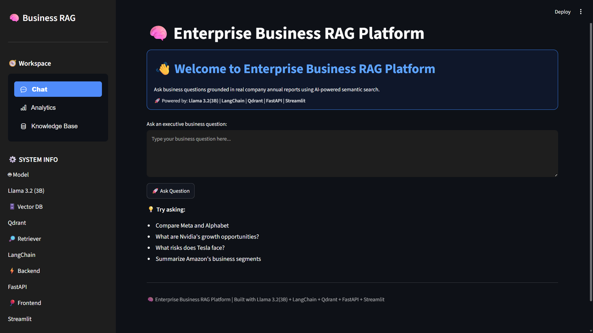

---

### Executive Summary Generation

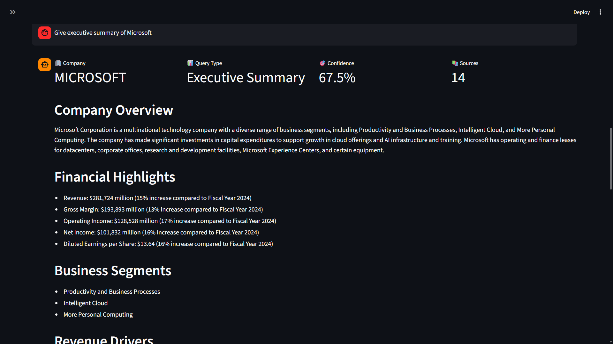

---

### Revenue Analysis

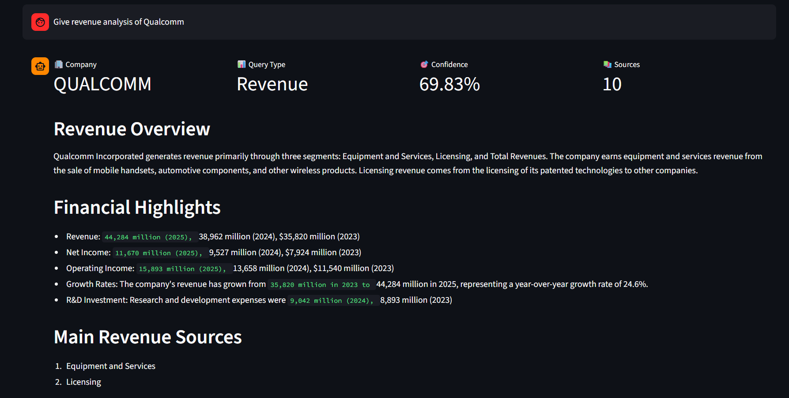

---

### Multi-Company Comparison

#### Part 1

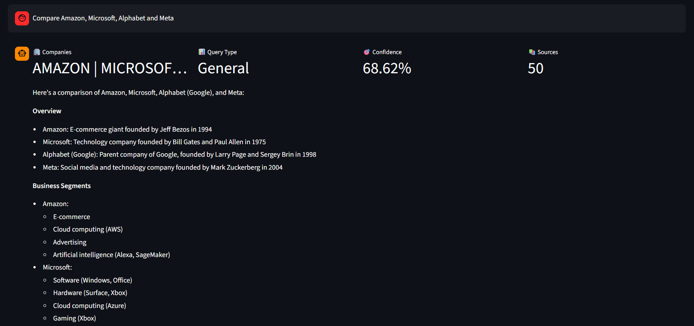

#### Part 2

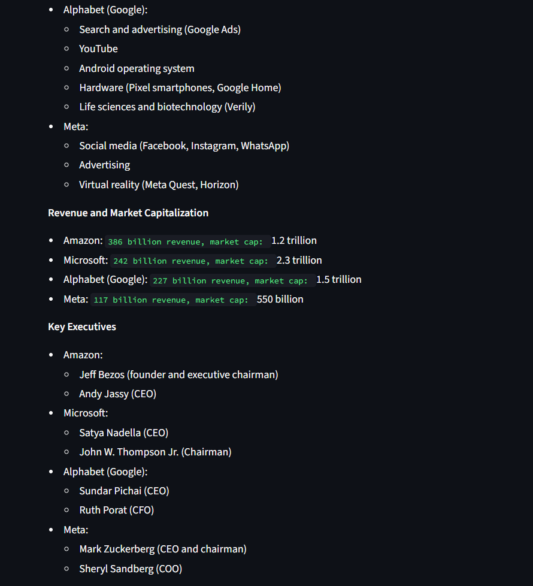

#### Part 3

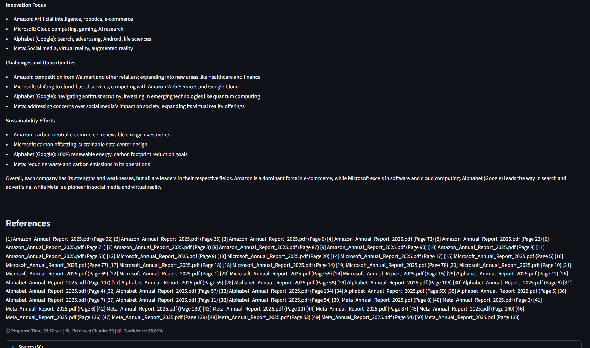

---

### Cloud Platform Comparison

#### Part 1

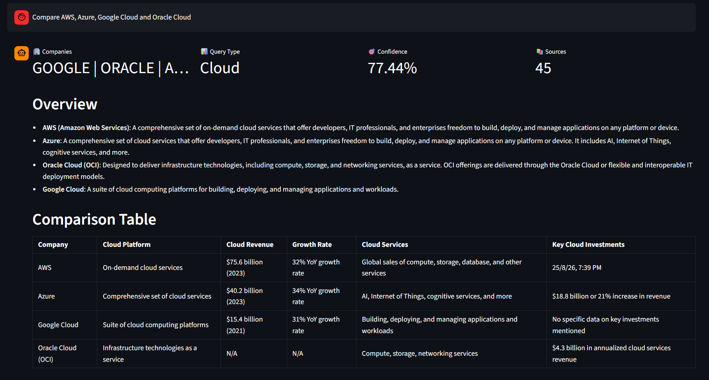

#### Part 2

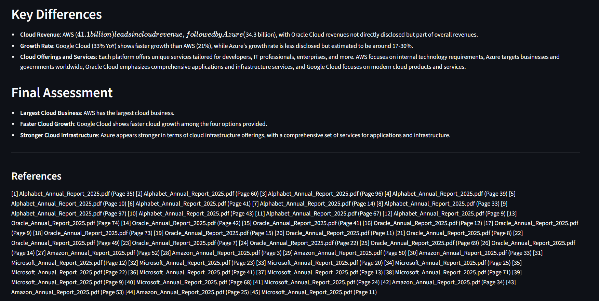

---

### Analytics Dashboard

#### Dashboard Overview

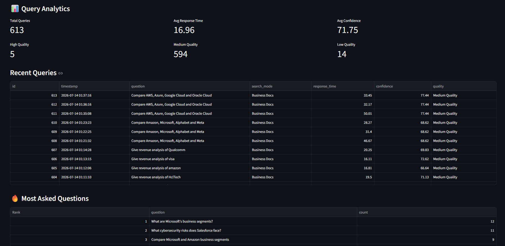

#### Query & Confidence Trends

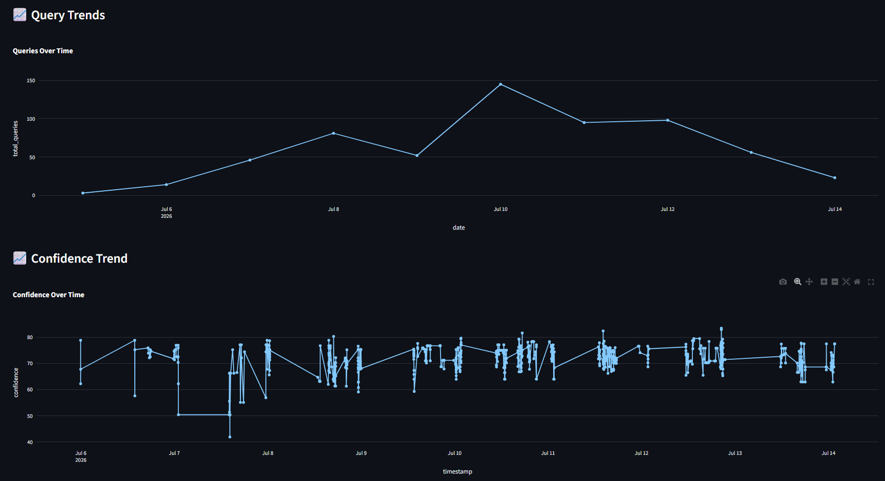

#### Performance Metrics

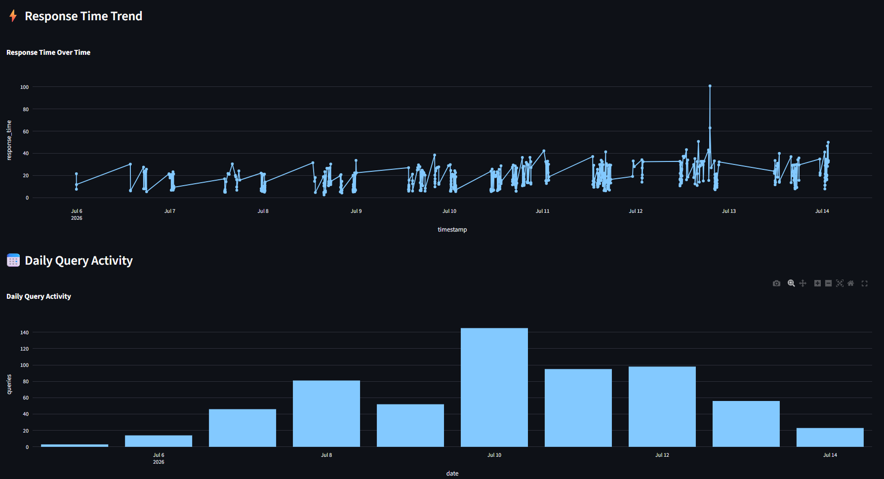

---

### Knowledge Base Overview

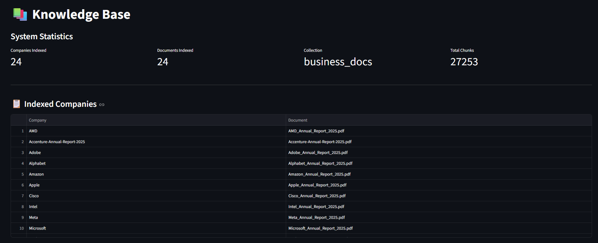

---

## Dataset

The platform currently indexes annual reports from 24 major companies.

### Technology

- Microsoft
- Amazon
- Alphabet
- Meta
- Apple
- Nvidia
- AMD
- Intel
- Oracle
- Salesforce
- Adobe
- Cisco
- Qualcomm

### Enterprise & Consulting

- Accenture
- Cognizant
- HCLTech
- IBM
- ServiceNow

### Consumer & Digital

- Walmart
- Netflix
- Tesla
- Uber
- PayPal
- Visa

---

## Example Business Questions

```text
Give executive summary of Microsoft

Give revenue analysis of Qualcomm

Compare Amazon, Microsoft, Alphabet and Meta

Compare AWS, Azure, Google Cloud and Oracle Cloud

Compare AI strategy of Microsoft, Meta, Alphabet and Nvidia

Compare risks faced by Amazon, Microsoft, Alphabet and Meta

What are Nvidia's growth opportunities?

What are Tesla's key risks?

Which company is best positioned for long-term AI growth?
```

---

## Project Structure

```text
Enterprise_Business_RAG_Platform/
│
├── app/
│   ├── api.py
│   ├── streamlit_app.py
│   ├── business_ingest.py
│   ├── hybrid_search.py
│   ├── query_analytics.py
│   ├── database.py
│   └── ...
│
├── data/
│
├── docs/
│   └── screenshots/
│
├── Dockerfile
├── docker-compose.yml
├── prometheus.yml
├── requirements.txt
│
└── README.md
```

---

## Installation & Setup

### Clone Repository

```bash
git clone https://github.com/HARSHIT-max07/Enterprise_Business_RAG_Platform.git

cd Enterprise_Business_RAG_Platform
```

### Install Dependencies

```bash
pip install -r requirements.txt
```

### Start Qdrant

```bash
docker run -p 6333:6333 qdrant/qdrant
```

### Start Ollama

```bash
ollama serve
```

### Pull Required Models

```bash
ollama pull llama3.2:3b

ollama pull nomic-embed-text
```

### Start FastAPI Backend

```bash
uvicorn app.api:app --reload
```

### Start Streamlit Frontend

```bash
streamlit run app/streamlit_app.py
```

---

## Project Highlights

- Indexed 24 enterprise annual reports
- Built semantic retrieval using vector embeddings
- Generated business-focused executive summaries
- Developed revenue analysis workflows
- Implemented multi-company comparison engine
- Added cloud platform comparison analysis
- Integrated FastAPI backend with Streamlit frontend
- Added analytics dashboard for query monitoring
- Integrated Prometheus and Grafana monitoring
- Dockerized deployment architecture
- Managed 27K+ document chunks in Qdrant

---

## Future Enhancements

- Scale to 100+ companies
- Hybrid Search (BM25 + Vector Search)
- Financial Trend Dashboards
- Cloud Deployment (AWS/Azure)
- Multi-Document Reasoning
- Real-Time Company News Integration
- Advanced KPI Tracking
- Enterprise Authentication & RBAC

---

## Author

**Harshit Verma**

B.Tech Artificial Intelligence & Data Science


---
